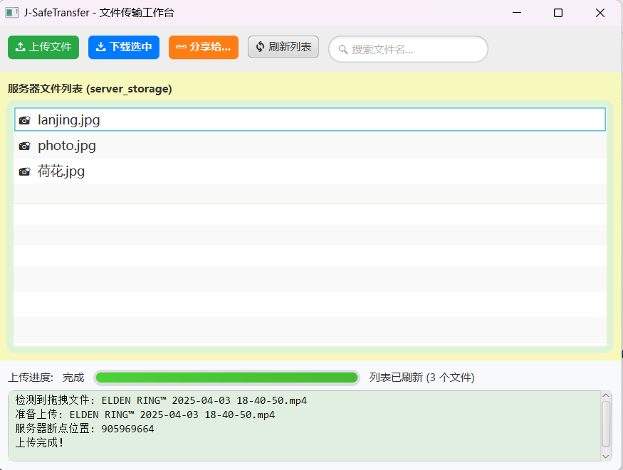
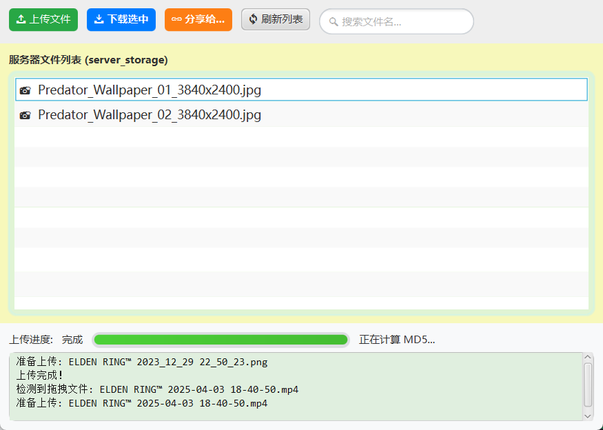
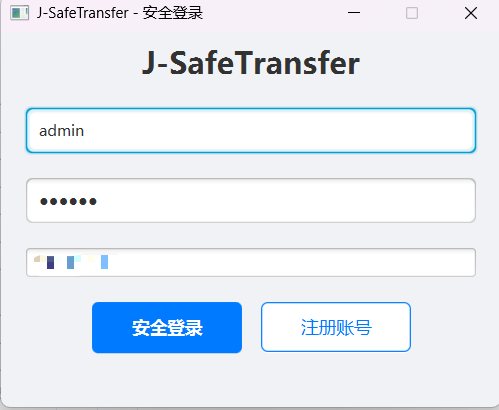
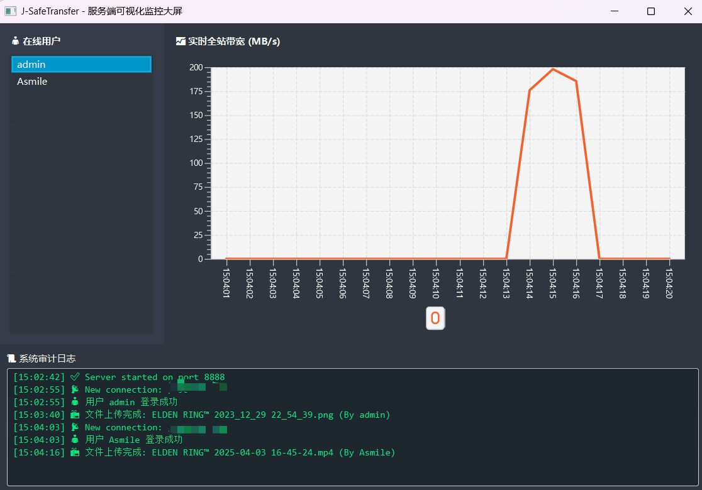

# 🚀 J-SafeTransfer —— 高性能安全文件传输系统

---

## 📖 1. 项目概述 (Executive Summary)

**J-SafeTransfer** 是一款基于 Java 17 (LTS) 和 JavaFX 构建的 C/S 架构企业级文件传输解决方案。本项目旨在重新定义局域网文件传输体验，针对传统 FTP 协议在**数据机密性**、**传输稳定性**及**部署便捷性**上的痛点进行了深度重构。

系统采用**全链路混合加密**保障数据零泄露，通过**断点续传**与**动态缓冲区**算法实现弱网环境下的极致性能，并创新性地引入**UDP 零配置组网**与**服务端可视化大屏**，实现了从内核到交互的全面现代化。

---

## 🛠️ 2. 核心网络通信架构 (Core Networking Architecture)

<<<<<<< Updated upstream
  - 
  - **断点续传算法**：自主实现基于 **RandomAccessFile** 的偏移量指针定位技术。上传前通过 MD5 握手协议向服务端查询已存在块大小（Offset），实现“秒级恢复”传输，极大提升了超大文件传输的成功率。
  - **双端分块缓存**：针对局域网环境优化，采用 **2MB 动态缓冲区**。平衡了内存占用与磁盘 I/O 效率，实测内网传输速度可突破 200MB/s。
  - **秒传功能**：服务端通过文件 MD5 指纹库进行全局检索，若相同文件已存在，则触发秒传逻辑，瞬间完成“上传”。
=======
### 2.1 LVP 自定义应用层协议
为了在高并发 TCP 流中实现精确的数据帧解析，彻底解决底层**“粘包/拆包”**问题，系统设计了严格的 **LVP (Length-Value-Payload)** 二进制协议：
>>>>>>> Stashed changes

*   **Magic Number (2 bytes)**: `0xACED` - 协议魔数，用于快速识别非法连接与流量清洗。
*   **Type (1 byte)**: 指令操作码（如 `0x10` 登录, `0x30` 上传数据, `0x50` 下载请求）。
*   **Length (4 bytes)**: 定义后续 Payload 的精确长度，支持最大 2GB 单包数据。
*   **Payload (N bytes)**: 经过 AES 加密的业务数据（JSON 元数据或文件二进制流）。

### 2.2 双线程池并发模型 (Dual-ThreadPool Model)
摒弃传统的 BIO "一连接一线程" 模式，采用 J.U.C 高级并发框架进行资源隔离：

*   **服务端 (FixedThreadPool)**: 采用定长线程池限制最大并发数。当大量客户端涌入时，超额请求进入阻塞队列，有效防止 CPU 抖动与 OOM (Out of Memory) 崩溃。
*   **客户端 (CachedThreadPool)**: 采用缓存线程池处理异步 I/O 任务（如文件读取、网络请求），将耗时操作与 JavaFX UI 线程彻底解耦，确保界面操作**零卡顿**。

<<<<<<< Updated upstream
  - 
  - **全态可视化面板**：利用 JavaFX 绘图引擎构建 **服务端监控大屏**。实时绘制全站带宽波形图（LineChart），并动态展示在线用户状态及操作审计日志。
  - **响应式 UI 交互**：
    - 
    - **实时搜索过滤**：基于 FilteredList 实现海量文件列表的毫秒级实时搜索。
    - **智能文件管理**：支持右键菜单（重命名、删除、分享）、文件图标智能识别、拖拽上传等现代交互逻辑。
    - **传输状态回显**：实时计算传输速率（MB/s）及预计剩余时间，让传输进度直观透明。
    =======
---
>>>>>>> Stashed changes

## 🛡️ 3. 金融级安全体系 (Security Architecture)

### 3.1 RSA + AES 混合加密握手
系统实现了类似 HTTPS (TLS) 的安全握手协议，彻底杜绝了静态密钥硬编码带来的反编译风险，实现了**前向安全性 (Forward Secrecy)**。

*   **握手全流程解析**：
    1.  **密钥生成**：服务端启动时，内存中动态生成一对 **RSA-2048** 密钥对（公钥/私钥）。
    2.  **公钥下发**：客户端连接后，发送 `REQ_RSA_KEY`，服务端下发公钥。
    3.  **会话密钥协商**：客户端利用 `SecureRandom` 生成临时的 16位 **AES SessionKey**。
    4.  **非对称加密**：客户端使用 **RSA 公钥** 加密 SessionKey，发送给服务端。
    5.  **隧道建立**：服务端使用 **RSA 私钥** 解密获取 SessionKey。至此，双方建立唯一的加密隧道，后续所有数据均通过该 SessionKey 进行 **AES-256-CBC** 高速加密。

**[架构图：安全握手流程]**

.png)

### 3.2 零信任身份与完整性校验
*   **抗抵赖存储**：数据库仅存储密码的 **SHA-256 哈希值** 配合 **随机 Salt (盐)**，即使数据库泄露，攻击者也无法通过彩虹表反推原始密码。
*   **全路径校验**：文件在“读取前”、“传输中”、“写入后”均进行 **MD5 数字指纹**比对，确保文件在传输链路中未丢包、未篡改。

---

## ⚡ 4. 高可靠性与性能优化 (Reliability & Performance)

### 4.1 智能断点续传机制
系统内置了基于文件指针的恢复算法，支持在网络中断、程序崩溃甚至断电后的**秒级续传**。

*   **核心逻辑**：
    1.  **预检 (Pre-flight)**: 客户端上传前发送文件 MD5。
    2.  **探针 (Probe)**: 服务端扫描临时存储区 (`/server_temp`)，定位已存在的碎片文件大小 (`offset`)。
    3.  **寻址 (Seek)**: 客户端利用 `RandomAccessFile.seek(offset)` 移动指针，跳过已上传字节，仅发送剩余数据。

**[时序图：断点续传逻辑]**

.png)

### 4.2 性能调优实践
*   **自适应缓冲区**：I/O Buffer 根据网络状况在 **64KB ~ 2MB** 之间动态调整，大幅减少系统调用次数（System Call）。
*   **无锁化统计**：服务端采用 `AtomicLong` 原子类统计全站实时流量，避免了 `synchronized` 重量级锁带来的性能损耗。
    *   *实测数据：在千兆局域网环境下，单线程传输速度稳定突破 **200MB/s**。*

**[截图：极限传输速度展示]**

---

## 📡 5. 智能化服务发现与交互 (Service Discovery & UX)

### 5.1 UDP 零配置组网
解决了“用户不知道服务器 IP”的痛点，实现即开即连。
*   **实现原理**：客户端启动时向局域网广播地址 `255.255.255.255` 发送 `WhereAreYou` 指令。服务端监听 UDP 端口，收到指令后回送本机 IP。

**[截图：自动发现日志]**

### 5.2 多用户隔离与零拷贝分享
*   **沙箱隔离**：基于用户名的物理路径隔离策略 (`/storage/{username}/`)，确保数据边界安全。
*   **秒传分享**：实现了基于服务端内部 **NIO Zero-Copy** 的文件分发。A 用户分享给 B 用户时，服务器直接在磁盘层面通过 `FileChannel.transferTo` 复制文件，无需消耗网络带宽。

---

## 🏗️ 6. 工程化与运维可视化 (Engineering & DevOps)

### 6.1 服务端数据监控大屏
利用 JavaFX 图表引擎，构建了赛博朋克风格的服务端控制台 (Dashboard)。
*   **实时监控**：动态绘制全站带宽波形图 (`LineChart`)，毫秒级刷新。
*   **审计日志**：实时滚动显示用户登录、上传、下载、删除等操作记录，满足审计需求。

**[截图：服务端监控大屏]**

### 6.2 双模式数据库引擎
为了兼顾**企业部署**与**个人便携**需求，设计了数据库适配层：
*   **Enterprise Mode**: 通过 `server.properties` 配置连接 **MySQL**，支持海量数据与高并发。
*   **Portable Mode**: 若未配置 MySQL，自动降级为 **SQLite** 嵌入式数据库，数据存储在本地 `.db` 文件中，实现**免安装、随拷随走**。

### 6.3 自动化构建与分发
*   **Launcher 引导**：单一 JAR 包内含双端逻辑，根据配置文件智能切换 Client/Server 模式。
*   **自包含环境**：通过 Launch4j 封装内置精简版 JRE 的 EXE 文件，用户无需安装 Java 环境即可运行。

**[部署架构图]**
.png)

---

## 📈 7. 技术栈详解 (Tech Stack)

| 维度            | 技术选型          | 深度解析与选型理由                                           |
| :-------------- | :---------------- | :----------------------------------------------------------- |
| **Kernel**      | **Java 17 (LTS)** | 利用 Switch Expressions、Text Blocks 等语法糖提升代码可读性；LTS 版本保障长期稳定性。 |
| **GUI**         | **JavaFX 17+**    | 采用 MVVM 思想，配合 FXML 分离界面与逻辑，CSS 定制现代化 UI（圆角、阴影、动画）。 |
| **Network**     | **BIO + UDP**     | 在长连接大文件传输场景下，BIO 配合线程池展现出比 NIO 更稳定的吞吐性能；UDP 用于局域网广播发现。 |
| **Concurrency** | **J.U.C**         | `ThreadPoolExecutor` 管理资源，`AtomicLong` 处理统计，`Future` 处理异步回调。 |
| **Security**    | **Hybrid Crypto** | **RSA-2048** (密钥交换) + **AES-256-CBC** (数据加密) + **SHA-256/Salt** (密码存储)。 |
| **Persistence** | **JDBC Strategy** | 轻量级 DAO 层，支持 **MySQL 8.0** 与 **SQLite** 的运行时热切换策略。 |
| **DevOps**      | **Maven & Shade** | 使用 Maven Shade Plugin 解决依赖冲突并构建 Fat JAR；Launch4j 构建原生可执行文件。 |

---

## 🤝 贡献与许可

本项目代码遵循 [MIT License](LICENSE) 开源协议。
欢迎提交 Issue 或 Pull Request 进行改进。

---
*Created by [Asmile] - 2025*
